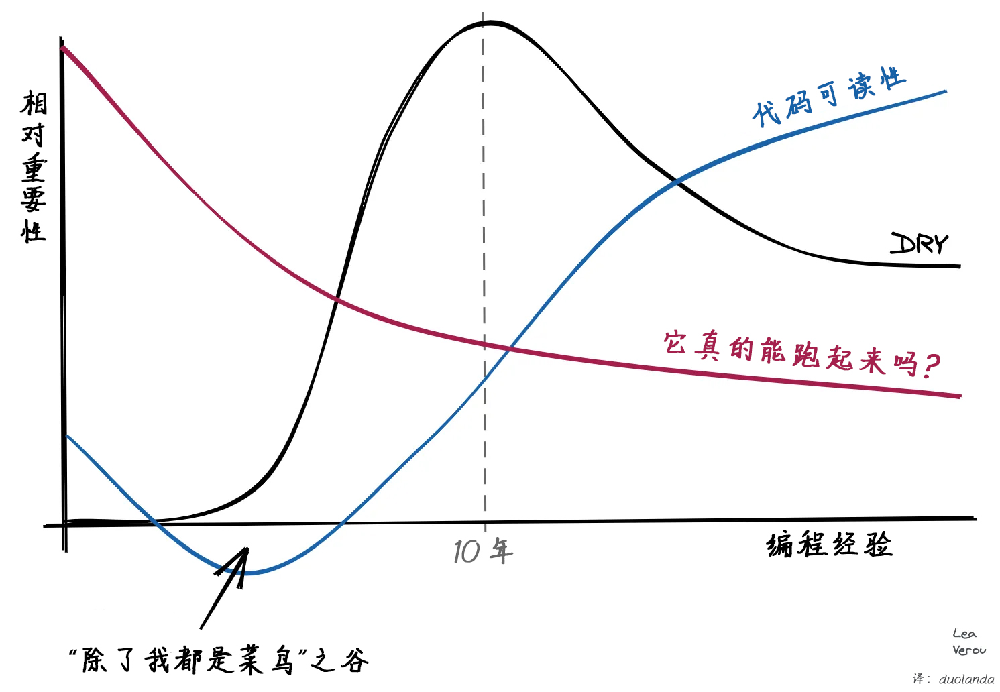

<div>
  <a href="https://www.redbubble.com/i/sticker/Programmer-Grug-by-colossalbreaker/42915272.EJUG5">
    
  </a>
  <h1>
     瓜哥脑程序员<br/>
     <small>一篇通俗指南，教你如何像有自知之明的小脑袋一样思考</small>
  </h1>
</div>

<div id="stuff">
<a id="book" href="https://www.lulu.com/shop/carson-gross/the-grug-brained-developer/paperback/product-2m47wqg.html">Book</a> | 
<a id="swag" href="https://swag.htmx.org/collections/grug">Swag</a>
</div>

# 引言

这是瓜哥脑程序员整理的软件开发心得

瓜哥脑程序员不够聪明，但瓜哥脑程序员写代码写好几年了，多少学到了一些东西，虽然大部分时候还是有些懵

瓜哥脑程序员试着将经验整理成一个简短、易于理解又有趣的页面，不只为了你，年轻的瓜哥，也为了他自己，因为随着瓜哥脑程序员变老，他会忘记重要的事情，比如早饭吃了什么或有没有穿裤子

有很多大脑袋程序员，其中有些人可能不喜欢这些内容，会摆出嫌弃脸

**自认为**自己是大脑袋程序员的人更多，他们大概也许有可能绝对不喜欢这个，嫌弃都快从脸上溢出来了（当代互联网现状）

（注意：瓜哥曾经以为自己是大脑袋，但吃了大亏）

没关系！

说到底这事也没那么重要，但瓜哥希望你读得开心，或许能从瓜哥漫长编程生涯中犯过的无数错误里学到点什么

# <a name="grug-on-complexity"></a>[永远的敌人：复杂性](#grug-on-complexity)

瓜哥的天敌是复杂性

复杂性坏

再说一遍：

复杂性**非常**坏

现在你说：

复杂性**非常、非常**坏

如果让瓜哥在复杂性和单挑霸王龙之间选，瓜哥选霸王龙：至少瓜哥看得见霸王龙

复杂性是一个恶灵，它通过那些好心但实则欠揍<sup>1</sup>的非瓜哥脑程序员和项目经理潜入代码库，这些人不害怕复杂性恶灵，甚至有时候根本意识不到它的存在

前一天代码库还很好懂，瓜哥能把活干完，一切都好！

第二天就坏了：复杂性恶灵进入了代码，情况非常危险！

瓜哥看不见复杂性恶灵，但瓜哥能感觉到它在代码库里的存在

复杂性恶灵嘲笑他：改这里，却搞坏那边！搞砸了吧？！哈哈，笑死！瓜哥太爱编程了，才不会像瓜哥前辈建议的那样去当个盲目跟风的投机客，专收集闪亮石头

棍子对复杂性恶灵没用，用棍子揍那个让恶灵进来的程序员也不是好主意：有时候那个人就是瓜哥自己！

可悲的是，常常就是瓜哥自己

所以瓜哥再说亿遍：复杂性**非常**、**非常**坏

## <a name="grug-on-saying-no"></a>[说“不”](#grug-on-saying-no)

对抗复杂性恶灵最好的武器是魔法词：“不”

“不，瓜哥不做那个功能”

“不，瓜哥不建那个抽象”

“不，瓜哥不用每日提肛或往杯子里泡红色浆果，你别再重复问了”

注意，这是好的工程建议，但却是坏的职业建议：“好”才是获得更多闪亮石头并被任命为程序员部落首领的魔法词

可悲又很现实：学会说“好”，然后在失败时就甩锅给其他瓜哥，堪称绝妙的职业建议

但瓜哥必须忠于瓜哥自己，“不”是瓜哥的魔法词。一开始很难说出口，特别是如果你是个好瓜哥，不喜欢让别人失望（这样的瓜哥有很多！），但随着时间推移会变得容易，即使闪亮石头因此变少了

没关系：瓜哥到底真正需要多少闪亮石头呢？

## <a name="grug-on-saying-ok"></a>[说“行”](#grug-on-saying-ok)

有时候妥协是必要的，否则没有闪亮石头，就意味着没有恐龙肉，这可不行，老婆会严厉地提醒瓜哥，家里还有小瓜哥们需要屋顶、食物等等，她早听腻了瓜哥对复杂性恶灵的抱怨，瓜哥已经反复念叨五十次了

在这种情况下，瓜哥最好说“行”

“行，瓜哥做那个功能”

然后瓜哥会花时间思考一个八二法则<sup>2</sup>的解决方案，然后做那个

八二法则解决方案是说“用 20% 的代码实现 80% 的需求”，这个方案可能没有项目经理想要的所有花里胡哨的功能，可能有点粗糙，但它能跑，并交付了大部分价值，而且在很大程度上将复杂性恶灵挡在门外

有时候最好干脆别告诉项目经理，直接用八二法则的方式去做。事后请求原谅比事前请求许可容易得多，项目经理的心思有时候比天气预报还善变，他们总是超负荷工作，要和很多瓜哥打交道。他们常常会忘记一个功能到底是要做什么，有的跳槽、有的辞职、有的被开除，瓜哥见过很多这样的案例

反正从结果来说这么干对项目经理也有好处，所以瓜哥通常不会对这种做法感到太内疚

## <a name="grug-on-factring-your-code"></a>[拆分你的代码](#grug-on-factring-your-code)

下一个策略非常难：正确地分解代码库（break code base up properly），或者更正式一点的说法：“正确地拆分你的代码（factor your code properly）”。这里很难给出通用建议，因为每个系统都如此不同。但是，瓜哥悟出一个道理：不要过早地拆分你的应用！

项目早期，一切都非常抽象，宛如盲人摸象，瓜哥的大脑几乎是一团浆糊。随着时间的流逝，系统才会慢慢形成“形状”，瓜哥也会越来越清楚自己到底在做什么。瓜哥在项目早期尽量不去做代码拆分，直到某个时间点，好的切分点会从代码库中自己浮现出来

一个好的切分点会通过极简的接口（narrow interface）与系统交互：仅暴露少数函数或抽象，将复杂性恶灵隐藏在内部，就像把它封印到了水晶里一样

当复杂性恶灵被恰当地困在水晶里时，瓜哥相当满意，能困住自己的死敌感觉再好不过了！

瓜哥试着耐心观察，等待切分点从代码中浮现，然后慢慢重构，代码库随着经验的积累而逐渐成形。没有硬指标定义到底什么是好的切分点，当瓜哥看到它们时，自然而然会明白“就是这个！”这种技能需要时间慢慢培养，没有捷径

有时候瓜哥下手太早，搞错了抽象，所以瓜哥倾向于等待

大脑袋程序员往往不喜欢这样，他们在项目刚开始时就发明很多抽象

瓜哥很想拿起棍子大喊：“大脑袋不维护代码！大脑袋去下一个架构委员会了，最后全是瓜哥擦屁股！”

但瓜哥学会了控制自己的情绪，这是瓜哥和动物的主要区别

相反，瓜哥试图在项目早期限制大脑袋程序员的破坏力，比如让他们画一些像 UML 图之类的东西（反正不会影响到代码，最后大概率也用不上），或者要求他们明天就拿出一个能跑的 demo

demo 是特别好的技巧：它迫使大脑袋做出点实际能运行的东西来讨论，具体代码会帮助大脑袋更快地认清现实情况

记住！大脑袋脑袋大！应该把它用于正道，而不是无意中为复杂性恶灵服务，后者瓜哥可见多了

（最厉害的瓜哥能够引导多个大脑袋向正确方向前进，并制造出许多困住复杂性恶灵的水晶，一大堆闪亮石头在等着这样的瓜哥！）

有时候这种 demo 也叫做“原型（prototype）”，对项目经理来说听起来更高级

瓜哥说，在软件开发的早期要做原型，**特别是**团队里大脑袋扎堆时

# <a name="grug-on-testing"></a>[测试](#grug-on-testing)

瓜哥对测试是爱恨交加：测试无数次地救了瓜哥，瓜哥爱并尊重测试

不幸的是，也存在很多测试砖家。一些测试砖家将测试奉为圭臬，甚至在瓜哥还没写代码，对当前领域一无所知的时候就“测试先行”！

瓜哥都还不懂这个领域，怎么测试？！

“哦，别担心：测试会告诉你需要做什么。”

瓜哥的手忍不住伸向棍子，但瓜哥保持冷静

瓜哥更喜欢在原型阶段之后写大部分测试，那时候代码已经开始变得坚实

但是，请注意：瓜哥在这里必须非常自律！

瓜哥很容易继续往下走而不写测试，因为“在瓜哥的机器上能跑”！

这是非常、非常坏的：不能保证在别的机器上能跑，也不能保证未来在瓜哥的机器上还能跑，这种情形并不少见

测试砖家关于测试重要性的观点是好的，即使测试砖家可能一辈子都没写出个有用的功能，整天只谈论测试，该揍，但出发点是好的

而且，测试砖家往往非常多地谈论单元测试，但瓜哥不觉得那么有用。瓜哥的经验是，理想的测试不是单元测试也不是端到端测试，而是介于二者之间的测试（in-between tests）

单元测试<sup>3</sup>虽然还不错，可一旦实现发生变化（比 API 变化多得多！）就会失效，反而增加重构的难度。而且坦率地说，许多 bug 常常是由于代码之间的交互引起的。代码一改动，这些测试一般也就被废弃了。

瓜哥主要在项目开始时写单元测试，有助于推动进展，但不会太执着，也不期望它能长期提供价值

端到端测试<sup>4</sup>也不错，可以证明整个系统能工作，但是！当它出问题时很难排查，常常让瓜哥发疯，有时候瓜哥们最后干脆忽略它，因为“反正这玩意经常出问题”，这样很不好！

介于二者之间的测试，瓜哥听砖家有时候叫它“集成测试”<sup>5</sup>，脸上伴随着嫌弃的表情。但瓜哥说集成测试才是瓜哥认为的最佳平衡点（sweet spot）：它足够高层（high level），可以验证系统的正确性；又足够底层 (low level)，配合好的调试器，很容易看出哪里有问题

瓜哥更倾向于在项目初期编写一些单元测试，但不是 100% 的代码都测试，也绝对不是“测试先行”。“边做边测”对瓜哥来说效果很好，特别是当瓜哥在摸索事情的时候

当切分点出现且系统稳定下来时，瓜哥会投入所有精力编写集成测试！切分点提供的 API 相对于内部实现来说应该是稳定的，集成测试可以在很长时间内保持价值，并且也容易 debug

此外，瓜哥还会创建一个精简的端到端测试套件，务必严格保证其正常运行，否则就该挨四十大板。端到端测试的重心在于最常见的 UI 功能和少数最关键的边缘情况（edge cases），不宜过多，以免因难以维护而沦落到被无视（ignore）的结局

这对瓜哥来说是理想的测试组合

你可能不喜欢，但这就是瓜哥测试的终极方案

另外，瓜哥不喜欢在测试中使用 mock<sup>6</sup>，除非绝对必要（极少/从不），并且只做粗粒度（在切分点/系统层面）的 mock

瓜哥不喜欢的“测试先行”有一个例外：当发现 bug 时。瓜哥总是先尝试用回归测试<sup>7</sup>复现 bug，**然后再**修复 bug，只有这种情况不知为何效果更好

# <a name="grug-on-agile"></a>[敏捷](#grug-on-agile)

瓜哥觉得敏捷不坏，也不好

说到底，它不是组织开发最糟糕的方式，也许比其他方式好，瓜哥觉得还行

但是，危险在于敏捷砖家！许许多多的闪亮石头都被敏捷砖家夺走了！

每当敏捷项目失败时，敏捷砖家就会说“你们没有正确地做敏捷！”瓜哥觉得这套说辞对敏捷砖家来说太方便了，他们会要更多的闪亮石头来更好地培训年轻瓜哥们学习敏捷，快跑！

每当听到太多关于敏捷的谈话时，瓜哥很想去拿棍子，但还是忍了下来

原型设计、工具和雇佣优秀的瓜哥才是软件成功的关键：敏捷流程还行，能帮上一些忙，但有时真太当回事则可能适得其反

瓜哥说没有能解决所有软件问题的银棍子<sup>8</sup>，无论敏捷砖家怎么说（快跑！）

# <a name="grug-on-refactoring"></a>[重构](#grug-on-refactoring)

重构是很好的活动，通常是好主意，尤其是在项目后期代码趋于稳定的时候

然而，瓜哥注意到在他的职业生涯中，很多次“重构”都严重偏离正轨，最终造成的损害比收益还多

瓜哥不确定为什么有些重构效果不错，有些就失败了，但瓜哥注意到重构规模越大，失败的可能性似乎就越大

所以瓜哥尽量让重构保持相对较小，在重构期间避免“离岸太远（too far out from shore）”。理想情况下，系统在整个过程中都应该能正常运行，确保一步完成之后再开始下一步

端到端测试在这里是救命稻草，但瓜哥经常搞不明白为什么它突然就跑不通了……这就是重构之路

瓜哥还注意到，引入过多的抽象常常导致重构失败和系统崩溃。一个典型的例子是 J2EE<sup>9</sup> 的引入，大脑袋们坐在一起过度设计抽象，结果一事无成，还给许多项目带来了损害

另一个好例子是瓜哥工作过的一家公司引入 OSGi<sup>10</sup> 来帮助管理/困住代码库里的复杂性恶灵。OSGi 不仅没帮上忙，反而让复杂性恶灵变得更强大了！他们投入顶尖程序员数年的时间来重构，结果复杂度猛增，更不用说实现新 feature 了！非常糟糕！

# <a name="grug-on-chestertons-fence"></a>[切斯特顿的栅栏](#grug-on-chestertons-fence)

聪明的瓜哥专家切斯特顿<sup>11</sup>曾经说过

> 在某种情况下存在某种制度或法律，为了简单起见，我们可以把它当做道路上竖立的一道栅栏或大门。激进的人会欢欣鼓舞地说：“我没有看到这东西有什么用处，让我们把它毁掉吧。”而更聪明的人则会说：“如果你没有看到它的用处，我不会让你清除掉它，走开吧，去想想看，当你能回来告诉我你看出它有什么用处时，我也许会允许你毁掉它。

许多年长的瓜哥都深刻领悟了这一教训：不要贸然删改代码，无论它们看起来有多丑

瓜哥明白所有程序员在某种程度上都是柏拉图主义者，希望代码有如音乐宇宙<sup>12</sup>般完美。但危险就在这里，现实世界很多时候是丑陋而草台班子的，所以代码有时也不得不如此

谦卑不常降临于大脑袋或自认为自己是大脑袋的人，甚至瓜哥自己也一样。瓜哥发现“这代码也太丑了，我要把它改掉”常常会导致数小时的痛苦，结果并没有更好，甚至把整个系统变得更糟了

瓜哥在职业生涯早期常常挥舞着棍子冲进代码库，把一切都砸得稀巴烂，后来才意识到这不好

瓜哥不是说永远不要改进系统，那太蠢了，而是建议先花时间理解系统，尤其是那种庞大的系统，并且要尊重当下能跑通的代码，哪怕它不够完美

此时测试往往是最好的警示牌，告诉你为什么这个栅栏不应该被砸掉！

# <a name="grug-on-microservices"></a>[微服务](#grug-on-microservices)

瓜哥想知道为什么大脑袋们非要选如何正确拆分系统这个最难的课题，然后还把网络调用也加上了

瓜哥完全想不通

# <a name="grug-on-tools"></a>[工具](#grug-on-tools)

瓜哥爱工具们。工具和情绪控制是区分瓜哥和恐龙的东西！工具让瓜哥的大脑也能编写出原本无法实现的代码，它们替瓜哥思考，简直是绝妙的解脱！瓜哥每到一个新环境总是花时间学习与工作相关的工具以最大化生产力：花两周学习工具通常能让开发速度翻倍，尽管经常需要四处向其他同事请教，毕竟这东西一般没有文档

IDE 里的代码补全让瓜哥不必记住所有 API，这非常重要！

对瓜哥来说，没有它，Java 编程几乎是不可能的！

这确实让瓜哥思考了好一阵子

优秀的调试器远远抵得过一堆闪亮石头：遇到 bug 时，瓜哥宁愿用所有闪亮石头外加几个孩子来换一个好的调试器，反正调试器根本不占重量，多多益善

瓜哥总是建议新手程序员深入学习可用的调试器，像条件断点、表达式求值、调用栈导航等功能，比大学课程教给新瓜哥的知识有用多了

瓜哥说，要不停地学习工具、用好工具

# <a name="grug-on-type-systems"></a>[类型系统](#grug-on-type-systems)

瓜哥非常喜欢能让编程更轻松的类型系统。对瓜哥来说，类型系统 90% 以上的价值在于当瓜哥敲击键盘上的点号时，会神奇的弹出一个列表，罗列瓜哥可以做的所有事情

大脑袋类型系统砖家常常说，确保类型正确性才是它的主要作用，但瓜哥注意到这些砖家很少交付代码。瓜哥想，永远不发布上线的代码在某种意义上是正确的，但这显然不是瓜哥所理解的正确

瓜哥说，工具神奇地弹出能做什么的列表和代码补全才是类型系统的主要好处，正确性也不错，但远没有那么重要

而且，这里要当心那些大脑袋！

有些类型大脑袋用类型系统思考，用引理论述，有潜在危险！

危险在于抽象层级过高，大脑袋们的类型系统代码变成了柏拉图式通用图灵计算模型在代码库里的星体投射。瓜哥同意在某种程度上这非常优雅，但是也很不解，因为任何事情都因此变得难以实现，哪怕是为瓜哥有限公司记录棍子数量这种本来随手就能搞定的任务。

泛型尤其危险，瓜哥建议把泛型限制在容器类这种最能体现它价值的地方

过度使用泛型是恶灵设下的陷阱！复杂性恶灵喜欢这一招！当心！

永远记住，类型系统最大的价值来自于：敲下点，看看瓜哥能做什么！

# <a name="grug-on-expression-complexity"></a>[表达式复杂度](#grug-on-expression-complexity)

瓜哥曾经非常喜欢尽可能地减少代码行数。代码写成这样：

```js
  if(contact && !contact.isActive() && (contact.inGroup(FAMILY) || contact.inGroup(FRIENDS))) {
    // ...
  }
```

 随着时间推移，瓜哥发现这很难调试，因此更倾向于这样写：  

```js
  if(contact) {
    var contactIsInactive = !contact.isActive();
    var contactIsFamilyOrFriends = contact.inGroup(FAMILY) || contact.inGroup(FRIENDS);
    if(contactIsInactive && contactIsFamilyOrFriends) {
        // ...
    }
  }
```

面对更多代码行和不必要的变量，年轻瓜哥们发出惊恐尖叫，瓜哥拿起棍子准备自卫

其他程序员开始发起代码风格攻击，瓜哥大喊：“这样更便于调试！每个表达式结果清晰可见！变量名有意义！条件判断一目了然！这 样 更 便 于 调 试！”

事实证明这确实让调试变得更轻松了，当棍子战争结束后，年轻的瓜哥们开始冷静下来思考，意识到瓜哥是对的

瓜哥偶尔还是会写出像第一个例子那样的烂代码，并常常后悔，所以瓜哥不评判年轻的瓜哥

# <a name="grug-on-dry"></a>[DRY](#grug-on-dry)

DRY<sup>13</sup> 的意思是“不要重复自己（Don't Repeat Yourself）”，这是大多数程序员心中至高无上的准则

瓜哥尊重 DRY，这是好建议，但是瓜哥认为正如最聪明的大脑袋亚里士多德说的那样，凡事都要平衡（balance in all things），

瓜哥发现 Lea Verou 画的曲线图很好体现了瓜哥的心路进程：



在过去十年的编程中，瓜哥逐渐不再那么执着于避免重复代码。只要足够简单明了，瓜哥觉得带有微小差异的复制粘贴代码，比许多通过参数传递的回调/闭包或复杂对象模型要好：有时候过度复杂的解决方案带来的收益实在是微乎其微

这里很难平衡，重复的代码总是让瓜哥盯着屏幕犯嘀咕，但经验表明重复代码有时候常常比复杂的 DRY 解决方案更好

请注意！瓜哥提醒过于教条的程序员不要把这句准则太当真，平常心就好

# <a name="grug-on-soc"></a>[关注点分离 (SoC)](#grug-on-soc)

关注点分离 (Separation of Concern, SoC) <sup>14</sup>是另一个备受程序员推崇的重要理念，这个理念主张将系统的不同层面拆分为独立的代码模块

最典型的例子就是 Web 开发：样式（css 文件）、标记（html 文件）和逻辑（javascript 文件）的分离

相比讨论 DRY 原则时，瓜哥的表情变得更加不懈。实际上，瓜哥还写了一篇大脑袋文章，提出了一个对立的设计原则——行为局部性 (locality of behavior, LoB)<sup>15</sup> 来反对 SoC

瓜哥更倾向于把代码写在执行对应功能的地方。这样当瓜哥看那个东西时，就能立马明白它的作用，这种一目了然的感觉真不错！

如果用关注点分离，瓜哥必须翻遍散落在各处的文件才能理解一个按钮的运作逻辑，令人困惑且浪费时间：坏！

# <a name="grug-on-closures"></a>[闭包](#grug-on-closures)

瓜哥喜欢将闭包用在正确的地方——通常是在对对象集合做抽象操作时

瓜哥警告，闭包就像盐、类型系统和泛型：少量就能见效，但用太多容易把事情搞砸，让人高血压

JavaScript 程序员将 JS 中一个特殊的复杂性恶灵称为“回调地狱”，因为 JS 库使用了太多的闭包，非常可悲，但恕瓜哥直言，JS 程序员也算是自食其果

# <a name="grug-on-logging"></a>[日志](#grug-on-logging)

瓜哥是日志的超级粉丝，并鼓励多多记录日志，尤其是在云端部署中。一些非瓜哥说日志有开销且不重要。瓜哥以前也这么想，现在不了

一个有趣的故事：瓜哥曾听说他的偶像 Rob Pike<sup>16</sup> 在谷歌做日志工作，当时就想：“要是 Rob Pike 都在搞日志，那瓜哥去那儿还能做什么？！”所以果断放弃谷歌。结果后来发现日志对谷歌超级重要，所以当然要最好的程序员来搞，瓜哥啊瓜哥！

别那么瓜哥脑了，瓜哥，现在闪亮石头少多了！

不过瓜哥最后还是进了一家好公司，而且 Rob Pike 的穿衣风格[越来越古怪](https://www.youtube.com/watch?v=KINIAgRpkDA)，所以总的来说结局还不错，但还是那句话：日志非常重要！

瓜哥关于日志的建议是：

* 在代码中所有主要的逻辑分支都记录日志（if/for）
* 如果一个“请求（request）”横跨（span）云基础设施中的多台机器，在所有日志中都包含请求 ID，以便可以分组追踪
* 尽可能实现日志级别的动态控制，方便瓜哥在排查问题时灵活开关（很多场景下都需要！）
* 尽可能实现按用户设置日志级别，方便定位特定用户的问题

最后两点在频繁排查生产系统中的 bug 时尤其方便，是非常好用的棍子

不幸的是，日志库往往过于复杂（Java，你为什么会[这样](https://stackify.com/logging-java/)？）。但根据瓜哥的经验，如果前期花时间搭建合适的日志基础设施，在后期会得到巨大回报

瓜哥认为，学校里应该多教一些日志技术

# <a name="grug-on-concurrency"></a>[并发](#grug-on-concurrency)

瓜哥，和所有心智正常的程序员一样，害怕并发

瓜哥尽可能地依赖简单的并发模型，比如无状态的 Web 请求处理，以及互不依赖且 API 简单的的远程作业队列

乐观并发控制<sup>17</sup>似乎在 Web 领域里很好用

在写框架的时候，瓜哥偶尔会用一下线程局部变量<sup>18</sup>

有些语言提供了优秀的并发数据结构，比如 Java 里的 [ConcurrentHashMap](https://docs.oracle.com/javase/8/docs/api/java/util/concurrent/ConcurrentHashMap.html)，但仍然需要瓜哥小心翼翼地去使用

瓜哥从没用过 Erlang<sup>19</sup>，听说很棒，但瓜哥感觉这个语言看起来有些奇怪，抱歉

# <a name="grug-on-optimizing"></a>[优化](#grug-on-optimizing)

一个超级大脑袋程序员曾经说过：

> 过早优化是万恶之源

这一点几乎所有人都知道，瓜哥举双手双脚赞同这位超级大脑袋的观点

瓜哥建议在开始优化之前，务必要先有一个具体的、真实场景下的性能分析报告（perf profile），并且能明确看出特定的性能问题

瓶颈的实际位置往往出人意料，瓜哥经常感到惊讶！非常惊讶！

不要只关注 CPU：CPU 很容易被看到，而且学校里也教了很多大 O 符号的思维，但这常常不是拖慢性能的唯一根源，包括瓜哥在内的许多人都曾为此感到惊讶

网络延迟堪比数百万个 CPU 周期，应尽可能最小化，请切记，大脑袋微服务程序员！

没经验的大脑袋程序员看到嵌套循环常常会说：“O(n^2)？休想在我的代码里出现！”

复杂性恶灵乐了

# <a name="grug-on-apis"></a>[APIs](#grug-on-apis)

瓜哥喜欢好的 API。好的 API 不会让瓜哥想太多

不幸的是，很多 API 非常糟糕，让瓜哥绞尽脑汁。有很多原因会造成这种情况，举两个例子：

* API 设计者总是从 API 的实现细节或专业领域的角度思考，而没有考虑到 API 的使用场景
* API 设计者思维太抽象或太大脑袋了

通常瓜哥并不太关心 API 的实现细节：如果想写文件或者排序列表之类的，调用 `write()` 、`sort()` 或别的什么就完事了

但是大脑袋 API 设计者说：

“我知道你很急，但是你先别着急，那个文件是以**写入模式**打开的吗？你定义排序用的**比较器**（Comparator）了吗？”

瓜哥发现自己的手又在伸向棍子了

瓜哥才懒得管这些呢，大脑袋先生，我只想排序和写文件！

瓜哥承认大脑袋 API 设计者有他的道理，**某些情况下**这些事情确实很重要，但大多数时间都不重要。大脑袋 API 设计者最好能为简单情况设计简单的API，再通过复杂的 API 满足更进阶的需求

瓜哥称之为“分层式 API 设计”：用两到三个不同复杂级别的 API，适配瓜哥的各种需求场景

另外，如果是面向对象，请把 API 直接放在相关对象上，而不是别处。Java 在这方面做得最差！

瓜哥想在 Java 里过滤（filter）一个列表（list）

“你把它转成流（stream）了吗？”

好吧，瓜哥把它转换成流

“好了，现在你可以过滤了。”

好的，但现在需要返回一个列表！你却给我一个流！

“那你把流收集成列表了吗？”

啥？

“定义一个`Collector<? super T, A, R>`来把你的流收集成列表”

瓜哥现在对着上天发誓，他要用棍子锤爆房间里的每一个人，但数到二的时候，他还是回归冷静了

把 `filter()`这样的常用功能放在列表上，并让它返回列表不行吗？大脑袋 Java API 程序员！

没人关心“流”，甚至之前都没听说过“流”，这不是网络 API，所有 Java 瓜哥都用列表，大脑袋先生！

# <a name="grug-on-parsing"></a>[解析](#grug-on-parsing)

瓜哥喜欢一有机会就创造编程语言，并且说递归下降<sup>20</sup>是编写解析器最有趣、最优美的方式

不幸的是，许多大脑袋学校只教解析器生成工具。在这里，瓜哥对工具的喜爱消失了：解析器生成工具产出的代码比鸟窝还乱：自底向上，什么鬼？这东西把语法的递归本质隐藏起来，根本没法调试，瓜哥觉得非常糟糕！

瓜哥觉得这是因为虽然复杂性恶灵对代码库和理解有害，但它特别适合批量产出学术论文，可悲但很真实

实际生产环境中的解析器几乎都是递归下降法，然而却被学校忽视了！当瓜哥发现解析是多么简单时，他非常愤怒！解析不是只有大脑袋才能懂的魔法：你上你也行！

瓜哥欣喜地发现大脑袋程序员 Bob Nystrom 为大脑袋部落挽回了颜面，他写了一本关于递归下降的杰作：《Crafting Interpreters（手撸解释器）》<sup>21</sup>

这本书可以免费在线阅读，但瓜哥强烈建议所有感兴趣的瓜哥们都掏钱购买这本书，它提供了许多大脑袋的建议，瓜哥非常喜欢这本书，除了访问者模式（那是个陷阱！）

# <a name="grug-on-visitor-pattern"></a>[访问者模式](#grug-on-visitor-pattern)

坏<sup>22</sup>

# <a name="grug-on-front-end-development"></a>[前端开发](#grug-on-front-end-development)

一些非瓜哥，面对 Web 开发时会说：

“我知道，我要前后端代码分离，用一个热门的新 SPA<sup>23</sup> 库，通过 HTTP 与 GraphQL JSON API 后端通信（有点讽刺，因为 HTTP 传的根本不是超文本）”

现在你得到了两个复杂性恶灵的巢穴

更糟的是，据瓜哥所知，前端复杂性恶灵格外强大，整个前端行业都深陷于它的精神控制

后端程序员尚且能让事情保持简单，但前端程序员会迅速堆砌出大量复杂代码，召唤出复杂性恶灵

哪怕只是做一个表单入库的网站或简单宣传页

如今人人都这么干！

瓜哥不太知道为什么，可能因为 Facebook 和谷歌都这么干？但这对瓜哥来说似乎不是一个好理由

瓜哥不喜欢大家都在用的那些大型复杂前端库

所以瓜哥做了 htmx<sup>24</sup> 和 hyperscript<sup>25</sup> 来避开它们

保持低复杂性，用简单的 HTML，少写 JavaScript，那是滋生复杂性恶灵的温床

也许它们适合你，但是没有招聘岗位，抱歉

React 确实更好找工作，也适用于某些场景，但无论你愿意与否，最后都会变成复杂性恶灵的奴仆，不好意思，可能这就是前端人的宿命

# <a name="grug-on-fads"></a>[潮流](#grug-on-fads)

瓜哥注意到业界有很多潮流，尤其是现今的前端开发

后端更好、更无聊，因为到现在为止所有坏主意可能都已经被试过了（不过还有一些仍在重蹈覆辙！）

前端开发仍在尝试所有坏主意，日新月异，层出不穷

瓜哥建议对所有革命性的新方法都持保留态度：大脑袋们研究计算机这么多年，大多数点子至少都被试过一遍了

瓜哥不是说现在没有好的新方法，也不是不能学新技巧，而是不要把太多时间浪费在那些回收再利用的坏主意上，把新想法胡乱塞进代码库只会助长复杂性恶灵的力量

# <a name="grug-on-fold"></a>[害怕看起来很傻](#grug-on-fold)

注意！如果资深瓜哥愿意公开说：“嗯…这个对瓜哥来说太复杂了！”，那非常好！

许多程序员害怕自己看起来很傻（Fear Of Looking Dumb，FOLD），瓜哥曾经也 FOLD，但瓜哥学会了克服它，因为一个非常重要的资深瓜哥说出了：“这个对我来说太复杂和迷惑了”

这让初级瓜哥们也能坦然承认有些代码太复杂且难以理解，事实上这种情况并不少见！FOLD 是复杂性恶灵控制程序员的主要力量来源，对于年轻的瓜哥们来说尤其如此！

夺走 FOLD 的力量来源，资深瓜哥做得非常好！

注意：说这话时要摆出思考的表情并让自己看起来像个大脑袋，这很重要！准备好被大脑袋，或者**自认为**自己是大脑袋的人冷嘲热讽，要命的是后者往往更常见

要坚强！拒绝 FOLD！

棍子在这里偶尔有用，但幽默感，特别是大脑袋们搞砸的上一个项目往往更有用，且非常有用，所以记得收集这些案例并保持淡定

# <a name="grug-on-imposter-syndrom"></a>[冒名顶替综合征](#grug-on-imposter-syndrom)

瓜哥发现开发中总会感到自己是冒名顶替者

瓜哥经常陷入两种状态：要么觉得自己是世界的主宰，挥舞着代码棍棒宛如雷神，要么完全不知道自己在做什么

瓜哥大部分时间都处于后一种状态，不过装的比较像样而已

到现在，瓜哥在工作中开发了许多软件，[在开源项目上也小有成就](https://star-history.com/#bigskysoftware/htmx&bigskysoftware/_hyperscript&Date)，然而瓜哥还是经常不知道自己在做什么！常常如此！瓜哥仍然害怕犯错，害怕搞坏别人的代码，让其他瓜哥失望，感到自己是冒名顶替者！

也许编程的本质就是让大多数瓜哥产生这种冒牌感，坦然接受就好：每个人都是冒名顶替者，就相当于每个人都不是冒名顶替者

任何能读到这里的年轻瓜哥在编程生涯中大概都会做得很好，即使，很遗憾，挫折和自我怀疑或许会一直都在

# <a name="grug-reads"></a>[阅读材料](#grug-reads)

瓜哥喜欢这些：

* [更坏就是更好 (Worse is Better)](https://www.dreamsongs.com/WorseIsBetter.html)
* [更坏就是更好是更坏 (Worse is Better is Worse)](https://www.dreamsongs.com/Files/worse-is-worse.pdf)
* [更坏真的更好吗？ (Is Worse Really Better?)](https://www.dreamsongs.com/Files/IsWorseReallyBetter.pdf)
* [软件设计哲学 (A Philosophy of Software Design)](https://www.goodreads.com/en/book/show/39996759-a-philosophy-of-software-design)

# <a name="lol-lmao"></a>[结语](#lol-lmao)

现在你说：复杂性**非常、非常**坏

# 注释
1：这里作者可能是玩了个双关，clubbable 既能指“合群的、容易相处的人”，也能和下文的棒打（club）呼应，蕴含“该打、欠揍”的意思。

2： 八二法则，也称帕累托法则、80/20 法则、二八法则：80% 的结果往往只由 20% 的关键因素决定，如 80% 的销售额来自 20% 的客户。 [帕累托法则](https://zh.wikipedia.org/wiki/%E5%B8%95%E7%B4%AF%E6%89%98%E6%B3%95%E5%88%99)

3：单元测试（unit test）是针对软件中的最小可测试单元（如函数、方法、类）进行正确性检验的测试方法。[单元测试](https://zh.wikipedia.org/wiki/%E5%8D%95%E5%85%83%E6%B5%8B%E8%AF%95)

4：端到端测试（end to end test）是从用户角度验证整个系统完整功能流程的测试方法，测试时需要模拟真实生产环境，整个系统及其子系统，包括 UI、API 等都要得到测试。[端到端测试](https://smartbear.com/learn/automated-testing/what-is-end-to-end-testing/)

5：集成测试（integration test）是验证多个软件模块或组件协同工作的测试方法，以确保不同模块组合起来之后依然可以正确工作。[集成测试](https://zh.wikipedia.org/wiki/%E9%9B%86%E6%88%90%E6%B5%8B%E8%AF%95)

6：Mock 是测试中用来模拟真实依赖对象行为的技术，模拟对象需要具有与其模仿的真实对象相同的接口。例如需要测试一个程序中的闹钟功能，就可以创建时间服务的模拟对象，保证测试时程序总是拿到特定的时间。[模拟对象](https://zh.wikipedia.org/wiki/%E6%A8%A1%E6%8B%9F%E5%AF%B9%E8%B1%A1)

7：回归测试（regression test）是在软件修改后重新执行之前的测试用例，确保新的代码变更没有破坏现有功能的测试方法。[回归测试](https://zh.wikipedia.org/zh-sg/%E5%9B%9E%E5%BD%92%E6%B5%8B%E8%AF%95)

8："没有银弹"是软件工程领域的著名论断，这个概念借用了民间传说中只有银弹才能杀死狼人的故事，意指在软件开发中不存在任何单一的技术、方法或工具能够神奇地解决所有复杂性问题并大幅提升生产力。[没有银弹](https://zh.wikipedia.org/wiki/%E6%B2%A1%E6%9C%89%E9%93%B6%E5%BC%B9)

9：Java 2 Platform Enterprise Edition，Sun 公司在 1999 年推出的企业级 Java 开发平台，用于在线开发、构建和部署基于 Web 的企业级应用程序，现已演化为 Jakarta EE。[J2EE](https://www.webopedia.com/definitions/j2ee/)

10：Open Services Gateway Initiative，开放服务网关协议，是一套用于开发和部署模块化软件程序和库的 Java框架。OSGi 为 Java 应用提供了组件化的运行时环境，每个模块都可以独立安装、卸载、启动和更新。[OSGi](https://www.techtarget.com/searchnetworking/definition/OSGi)

11：英国著名作家、文学评论家，代表作《布朗神父探案集》 [吉尔伯特·基思·切斯特顿](https://zh.wikipedia.org/wiki/%E5%90%89%E7%88%BE%E4%BC%AF%E7%89%B9%C2%B7%E5%9F%BA%E6%80%9D%C2%B7%E5%8D%BB%E6%96%AF%E7%89%B9%E9%A0%93)

12：音乐宇宙（Music of the Spheres），又称天体音乐，是古希腊哲学家毕达哥拉斯提出的概念，认为天体运行会产生和谐的音乐，在该语境下可理解为宇宙万物的内在秩序与和谐。[音乐宇宙](https://zh.wikipedia.org/wiki/%E9%9F%B3%E4%B9%90%E5%AE%87%E5%AE%99)

13：软件开发中的基本原则，要求相同的逻辑代码不应在多处出现，旨在减少重复代码，避免冗余。[不用重复你自己](https://zh.wikipedia.org/wiki/%E4%B8%80%E6%AC%A1%E4%B8%94%E4%BB%85%E4%B8%80%E6%AC%A1)

14：一种将代码库拆分为不同独立模块的设计原则，每个模块仅处理单一关注点，比如将用户界面、业务逻辑和数据存储分离的 MVC 架构就是这一原则的典型体现。[关注点分离](https://zh.wikipedia.org/wiki/%E5%85%B3%E6%B3%A8%E7%82%B9%E5%88%86%E7%A6%BB)

15：原文作者提出的设计原则，强调相关的代码应该在物理位置上尽可能靠近。当程序员需要理解或修改某个功能时，只需观察单个区域就可以直观了解相关行为。[Locality of Behaviour (LoB)](https://htmx.org/essays/locality-of-behaviour/)

16：加拿大计算机科学家，UTF-8 标准和 Go 语言的联合创造者之一。[Rob Pike](https://zh.wikipedia.org/wiki/%E7%BE%85%E5%8B%83%C2%B7%E6%B4%BE%E5%85%8B) 

17：一种并发控制的方法，假设数据冲突很少发生，允许多事务同时访问数据而不加锁，只在数据提交更新时才检查是否存在冲突。[乐观并发控制](https://zh.wikipedia.org/wiki/%E4%B9%90%E8%A7%82%E5%B9%B6%E5%8F%91%E6%8E%A7%E5%88%B6)

18：线程局部变量是为每个线程提供独立数据副本的变量，同一变量在不同线程中拥有不同的值，线程间互不干扰，可以解决多线程并发访问时的线程安全问题。[线程局部存储](https://zh.wikipedia.org/wiki/%E7%BA%BF%E7%A8%8B%E5%B1%80%E9%83%A8%E5%AD%98%E5%82%A8)

19：一门函数式编程语言，专为构建高并发、高可用性的分布式系统而设计，支持通过轻量级进程实现大规模（百万、千万级）并发。[Erlang](https://zh.wikipedia.org/wiki/Erlang)

20：递归下降解析器是一种自顶向下的语法分析技术，因具有实现简单、代码结构与语法规则高度对应、易于理解和调试等优点而被广泛采用。[递归下降解析器](https://zh.wikipedia.org/wiki/%E9%80%92%E5%BD%92%E4%B8%8B%E9%99%8D%E8%A7%A3%E6%9E%90%E5%99%A8)

21：网络上有这本书的中文翻译版，感兴趣的读者可以自己找来阅读，关键字：craftinginterpreters_zh。[Crafting Interpreters](https://craftinginterpreters.com/)

22：访问者模式是一种将算法与对象结构分离的软件设计模式，允许在不修改现有类的情况下为类层次结构添加新的操作。原文只在这里贴了访问者模式的英文维基百科链接，推断原作者说它不好是因为它会破坏封装性，增加复杂性，让代码变得难以维护。[访问者模式](https://zh.wikipedia.org/wiki/%E8%AE%BF%E9%97%AE%E8%80%85%E6%A8%A1%E5%BC%8F)

23：Single Page Application，单页应用，一种 Web 应用架构，整个应用只有一个 HTML 页面，通过 JavaScript 动态更新页面内容而不需要重新加载整个页面，React、Angular、Vue.JS 都是著名的单页应用框架。[单页应用](https://zh.wikipedia.org/wiki/%E5%8D%95%E9%A1%B5%E5%BA%94%E7%94%A8)

24：一个轻量级的 JS 库，允许程序员通过 HTML 属性直接使用 AJAX、CSS 过渡、WebSocket 和服务器发送事件等功能，而无需编写复杂的 JS 代码。[htmx](https://htmx.org/)

25：一个轻量级前端脚本语言，可以直接嵌入 HTML 来处理 DOM 交互和事件响应。[hyperscript](https://hyperscript.org/)
